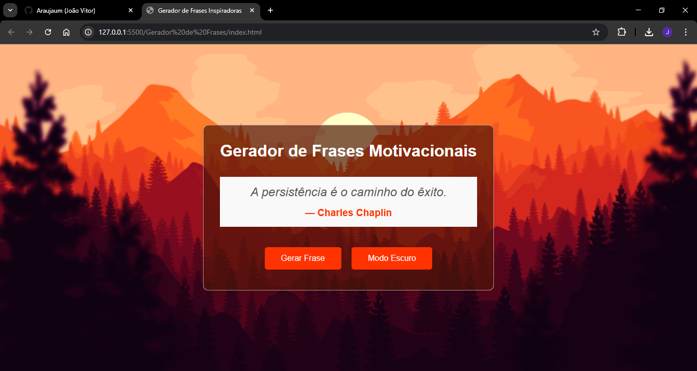
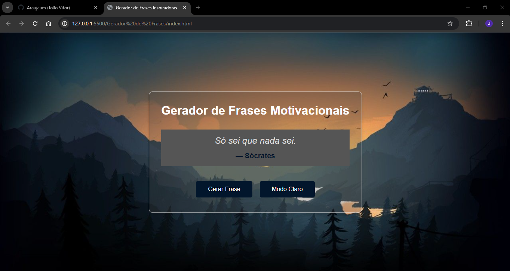

# Gerador de Frases Motivacionais

## 📝 Descrição

Este projeto é um **Gerador de Frases Motivacionais** com funcionalidade para alternar entre **Modo Claro** e **Modo Escuro**. Ele utiliza uma API para gerar frases inspiradoras, mas também tem frases locais para quando a API estiver indisponível. A interface foi feita com HTML e CSS, enquanto o comportamento dinâmico foi implementado em JavaScript.

---

## ⚙️ Tecnologias Utilizadas

- **HTML5**: Estrutura da página web.
- **CSS3**: Estilos e design responsivo.
- **JavaScript (ES6)**: Interatividade, busca de citações na API e alternância de temas.
- **API**: [quotable.io](https://api.quotable.io) para gerar frases aleatórias.

---

## 📸 Visualização

### Modo Claro



### Modo Escuro



---

## 🚀 Como Usar

1. **Clone este repositório:**
   ```bash
   git clone https://github.com/seu-usuario/gerador-citacoes.git
   ```
2. Abra o arquivo index.html em seu navegador: Basta clicar no arquivo para visualizar a página.
3. Gerar uma Citação: Clique no botão "Gerar Frase" para receber uma nova citação inspiradora. A frase será carregada automaticamente da API. Se a API estiver indisponível, uma frase local será mostrada.
4.Alternar Tema: Clique no botão "Modo Escuro" ou "Modo Claro" para alternar entre os dois temas da interface.

---

## 💻 Funcionalidades

Gerador de Citações Aleatórias: As citações são puxadas de uma API, mas, se a API falhar, o sistema utiliza um conjunto de citações locais.
Modo Claro e Escuro: A alternância de temas proporciona uma experiência personalizada para o usuário.

---

## 🌱 Contribuindo

1. **Faça um Fork deste repositório.**
2. **Crie uma nova branch para suas modificações.**
3. **Comite suas alterações.**
4. **Envie um Pull Request.**

Fique à vontade para sugerir melhorias ou adicionar novos recursos!

---

## 📂 Estrutura de Diretórios
gerador-citacoes/
├── index.html          # Página principal
├── styles.css          # Estilos da página
├── script.js           # Lógica JavaScript
├── assets/             # Imagens e outros recursos
│   ├── mode-light.png  # Imagem do modo claro
│   └── mode-dark.png   # Imagem do modo escuro
└── README.md           # Este arquivo

## 🎨 Agradecimentos
API quotable.io[https://github.com/lukePeavey/quotable] - Para fornecer citações inspiradoras.
